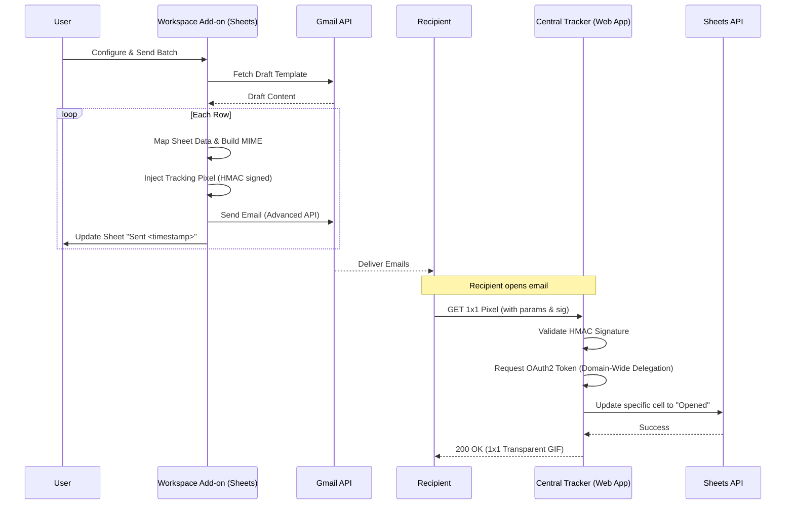

# UNAVSA Mail Merge Architecture

This document provides a technical overview of the UNAVSA Mail Merge system. The project is divided into two decoupled Google Apps Script deployments to handle the user-facing campaign execution and the centralized tracking of email opens.

## System Overview

The system consists of two primary components:
1.  **Workspace Add-on (`src/`)**: A Google Sheets Add-on that users install to configure and execute mail merges. It handles UI, draft parsing, email construction, batch sending, and background analytics (replies/bounces).
2.  **Central Tracker Web App (`central-tracker/`)**: A standalone Google Apps Script Web App deployed globally for the organization. It serves a 1x1 transparent tracking pixel and updates the sender's spreadsheet when an email is opened.

---

## 1. Workspace Add-on (`src/`)

This is the core application bound to the user's Google Workspace account. It runs entirely within the V8 runtime environment.

### 1.1 UI Layer (`src/ui/CardUI.js`)
The user interface is built using the Google Workspace Add-on `CardService`. Unlike older HTML Service sidebars, CardService provides a native, consistent Google Material Design experience directly within the Google Sheets right-hand sidebar.
*   **Trigger**: The UI is initialized via the `onOpen` or `homepageTrigger` defined in `appsscript.json`.
*   **State**: The UI is stateless; it reads available drafts and sheet headers on load.

### 1.2 State Management (`src/core/Config.js`)
Because Google Apps Script executions are stateless and have strict time limits, state must be persisted across executions.
*   **PropertiesService**: Used to store long-term campaign configuration (Selected Draft ID, Sender Alias, Reply-To, Scheduled Time).
*   **CacheService**: Used for short-term, high-frequency state, specifically caching the progress of a running batch so the UI can poll and display a progress bar.

### 1.3 MIME Engine & Sending (`src/utils/MimeBuilder.js` & `src/services/SendEngine.js`)
The system uses the Advanced Gmail API (`Gmail.Users.Messages.send`) rather than `MailApp` or `GmailApp.sendEmail()`. This is crucial for tracking.
*   **RFC 2822 Construction**: `src/utils/MimeBuilder.js` manually constructs raw, multipart MIME messages encoded in URL-safe Base64. This allows for inline images, attachments, and most importantly, custom headers.
*   **Custom Headers**: During construction, the system injects `X-Campaign-ID` and `X-Row-ID` into the email headers. These are invisible to the recipient but essential for tracking replies and bounces.
*   **Tracking Pixel Injection**: The HTML body is parsed, and an `` tag pointing to the Central Tracker Web App is injected before the closing `</body>` tag.
*   **Timeout Chunking**: GAS scripts timeout after 6 minutes. `src/services/SendEngine.js` monitors execution time. If it approaches 4.5 minutes, it saves the `lastProcessedRow` to `PropertiesService` and schedules a time-driven trigger (`ScriptApp.newTrigger()`) to resume the batch 1 minute later.

### 1.4 Background Analytics (`src/core/Analytics.js`)
While opens are tracked instantly via the Central Tracker, replies and bounces are processed asynchronously by the sender's account.
*   **Inbox Scanner**: A time-driven trigger runs every 3 hours to scan the user's Gmail inbox.
*   **Bounces**: Searches for `from:mailer-daemon` and parses the Non-Delivery Report (NDR) for the original `X-Campaign-ID` and `X-Row-ID` custom headers, falling back to regex email matching.
*   **Replies**: Searches for recent inbox messages (`in:inbox newer_than:7d -from:me`) and checks for the `X-Campaign-ID` or `X-Row-ID` headers to match replies from recipients in the sheet.
*   **Status Updates**: The script updates the "Merge Status" column in the original Google Sheet.

---

## 2. Central Tracker Web App (`central-tracker/`)

This is a globally accessible, standalone Apps Script project deployed as a Web App (`Execute as: Developer`, `Access: Anyone`).

### 2.1 Webhook Endpoint (`central-tracker/core/Tracker.js`)
The app exposes a `doGet(e)` endpoint. When an email recipient opens an email, their mail client attempts to load the injected 1x1 image, hitting this URL with specific query parameters:
*   `sheetId`: The ID of the sender's Google Sheet.
*   `sheetName`: The specific tab name.
*   `cell`: The specific cell notation (e.g., `Z2`) in the "Merge Status" column (used as a fallback).
*   `user`: The email address of the sender.
*   `ts`: The timestamp when the email was sent, used to prevent premature open tracking from immediate pre-fetches.
*   `tid`: A unique Tracking ID generated for each email sent.
*   `sig`: An HMAC-SHA256 signature.

### 2.2 Security (HMAC Validation)
To prevent malicious actors from arbitrarily updating cells in organizational spreadsheets by guessing URLs, the Add-on generates an HMAC-SHA256 signature using a shared secret stored in `PropertiesService`.
*   The Tracker recalculates the signature using the incoming parameters and the shared secret.
*   If the signatures do not match, the request is rejected with a 403 Forbidden.

### 2.3 Authentication Flow (Domain-Wide Delegation)
Because the Web App runs as the Developer (not the Sender), it cannot natively edit the Sender's private spreadsheet.
*   **Service Account**: The Tracker uses a Google Cloud Platform (GCP) Service Account with Domain-Wide Delegation enabled.
*   **OAuth2**: Using the `OAuth2` Apps Script library, the Tracker requests an access token, impersonating the `user` (Sender) passed in the URL parameters.
*   **Sheets API v4**: With the impersonated token, the Tracker makes a REST call to the Google Sheets API (`UrlFetchApp.fetch`) to search for the cell containing the `tid` in its note. It then updates that specific cell to "Opened <timestamp>". If the search fails, it falls back to the `cell` parameter.
*   **Response**: Regardless of success or failure, the endpoint returns a `ContentService.MimeType.GIF` representing a 1x1 transparent pixel so the recipient's email client renders it without error.
