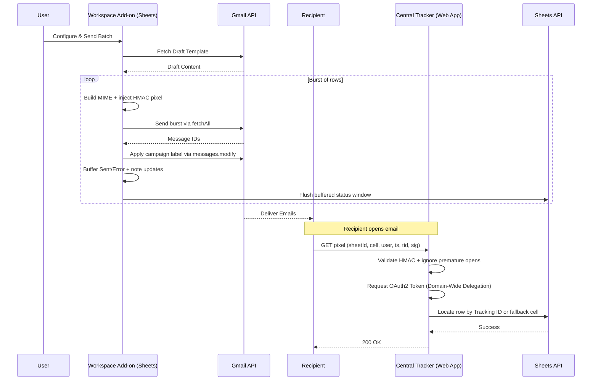

# UNAVSA Mail Merge Architecture

This document provides a technical overview of the UNAVSA Mail Merge system. The project is divided into two decoupled Google Apps Script deployments to handle the user-facing campaign execution and the centralized tracking of email opens.

## System Overview

The system consists of two primary components:

1.  **Workspace Add-on (`src/`)**: A Google Sheets Add-on that users install to configure and execute mail merges. It handles UI, draft parsing, email construction, batch sending, and background analytics (replies/bounces).
2.  **Central Tracker Web App (`central-tracker/`)**: A standalone Google Apps Script Web App deployed globally for the organization. It serves a 1x1 transparent tracking pixel and updates the sender's spreadsheet when an email is opened.

```mermaid
sequenceDiagram
    participant User
    participant AddOn as Workspace Add-on (Sheets)
    participant Gmail API
    participant Recipient
    participant Tracker as Central Tracker (Web App)
    participant Sheets API

    User->>AddOn: Configure & Send Batch
    AddOn->>Gmail API: Fetch Draft Template
    Gmail API-->>AddOn: Draft Content
    loop Burst of rows
        AddOn->>AddOn: Build MIME + inject HMAC pixel
        AddOn->>Gmail API: Send burst via fetchAll
        Gmail API-->>AddOn: Message IDs
        AddOn->>Gmail API: Apply campaign label via messages.modify
        AddOn->>AddOn: Buffer Sent/Error + note updates
        AddOn->>Sheets API: Flush buffered status window
    end
    Gmail API-->>Recipient: Deliver Emails

    Note over Recipient,Tracker: Recipient opens email
    Recipient->>Tracker: GET pixel (sheetId, cell, user, ts, tid, sig)
    Tracker->>Tracker: Validate HMAC + ignore premature opens
    Tracker->>Tracker: Request OAuth2 Token (Domain-Wide Delegation)
    Tracker->>Sheets API: Locate row by Tracking ID or fallback cell
    Sheets API-->>Tracker: Success
    Tracker-->>Recipient: 200 OK
```

---

## 1. Workspace Add-on (`src/`)

This is the core application bound to the user's Google Workspace account. It runs entirely within the V8 runtime environment.

### 1.1 UI Layer (`src/ui/CardUI.js`)

The user interface is built using the Google Workspace Add-on `CardService`. Unlike older HTML Service sidebars, CardService provides a native, consistent Google Material Design experience directly within the Google Sheets right-hand sidebar.

- **Trigger**: The UI is initialized via the `onOpen` or `homepageTrigger` defined in `appsscript.json`.
- **State**: The UI is stateless; it reads available drafts and sheet headers on load.

### 1.2 State Management (`src/core/Config.js`)

Because Google Apps Script executions are stateless and have strict time limits, state must be persisted across executions. To support running across multiple spreadsheets — **and multiple tabs within one spreadsheet** — for the same user without state collision, all properties are stored using **composite keys scoped by both spreadsheet and tab** (e.g., `${spreadsheetId}_${sheetName}_BATCH_CONFIG`). This makes each tab a fully independent campaign: its own draft/sender config, resume state, campaign ID/label, and reply/bounce cursors.

- **PropertiesService**: Used to store long-term campaign configuration (Selected Draft ID, Sender Alias, Reply-To) scoped to the user and the specific spreadsheet **+ tab**.
- **Trigger Context Mapping**: Background time-driven triggers execute without an active UI context (no active spreadsheet/sheet). To resolve this, the system maps `triggerUid` to the originating `{spreadsheetId, sheetName}` in `UserProperties` when a trigger is created (`mapTriggerToSpreadsheet`), and `setTriggerSpreadsheetIdContext` restores that scope at the start of the background run so it loads the correct tab's composite-keyed state. The analytics scanner is mapped at the spreadsheet level and iterates a per-spreadsheet registry of campaign tabs (`registerCampaignTab_` / `getCampaignTabs_`) so a single scanner covers every sent tab. The analytics scanner trigger automatically expires and deletes itself once all campaign tabs on the spreadsheet exceed 7 days (checked via `CAMPAIGN_START_TIME`).
- **CacheService**: Used for short-term, high-frequency state, specifically caching the progress of a running batch so the UI can poll and display a progress bar.
- **Dead-Letter Logging**: Errors from asynchronous background processes (like time-driven triggers) are sent to a hidden `_Logs` sheet tab via `src/utils/ErrorLib.js`.

### 1.3 MIME Engine & Sending (`src/utils/MimeBuilder.js` & `src/services/SendEngine.js`)

The system uses raw MIME construction plus the Gmail API rather than `MailApp` or `GmailApp.sendEmail()`. This is crucial for tracking, throughput, and custom label application.

- **RFC 2822 Construction**: `src/utils/MimeBuilder.js` manually constructs raw, multipart MIME messages encoded in URL-safe Base64. This allows for inline images, constant draft attachments, and custom headers. Dynamic personalized attachments from Google Drive are omitted to maximize performance and avoid Drive API rate limits.
- **Custom Headers**: During construction, the system injects `X-Campaign-ID`, `X-Row-ID`, and `X-Tracking-ID` into the email headers. These are invisible to the recipient but essential for tracking replies, bounces, and tracker row resolution.
- **Tracking Pixel Injection**: The HTML body is parsed, and an `` tag pointing to the Central Tracker Web App is injected before the closing `</body>` tag.
- **Burst Sending**: Instead of sending one message at a time, the engine prepares bursts of rows, then calls the Gmail REST send endpoint in parallel with `UrlFetchApp.fetchAll`. This reduces per-message network overhead substantially.
- **Bulk Hidden Row Mapping**: Instead of running row-by-row `isRowHiddenByUser` / `isRowHiddenByFilter` calls (which trigger slow individual Sheets API requests), the system calls `Sheets.Spreadsheets.get` (Sheets API v4) to retrieve row metadata for the entire sheet in a single request, reducing execution time from minutes to under 100ms.
- **Buffered Sheet Writes**: Merge statuses, status notes, and Tracking ID notes are updated in memory and flushed back to the sheet as a contiguous row window instead of performing per-row `setValue()` and `setNote()` calls.
- **Campaign Labels**: After each successful send, the engine applies the campaign label with `users.messages.modify`. The send payload itself is not relied on for custom label propagation.
- **Race-Safe Status Merging**: Before flushing buffered send results, the engine re-reads the dirty status window and preserves `Opened`, `Replied`, or `Bounced` rows that may already have been written by the tracker or analytics scanner.
- **Timeout Chunking**: `CardService` action callbacks are hard-limited to 30 seconds, so the synchronous UI pass (`startBackgroundBatchEmails` → `sendBatchEmails(config, 0, true)`) sends for at most ~25 seconds — enough to dispatch the first few hundred recipients instantly with visible status. If rows remain, it saves `lastProcessedRow` to `PropertiesService` and creates a continuation trigger with `timeBased().after(1)` so the background run starts as soon as Apps Script can schedule it (no deliberate wait). Background executions get the full 6-minute window (`MAX_EXECUTION_MS` = 4.5 min guard), so a typical ≤500-row campaign finishes its remainder in a single continuation. Only campaigns larger than one 4.5-minute background run chain additional `after(1)` resumes.
- **Concurrency Lock (per tab)**: Sends are serialized **per tab** via `acquireSendLock_(spreadsheetId, sheetName)` (`src/core/Config.js`). A short `LockService` lock guards an atomic test-and-set of a per-tab "send in progress" marker stored in `DocumentProperties` (shared across all users of the spreadsheet; falls back to `ScriptProperties` in background contexts). The marker auto-expires after ~7 minutes so a crashed run can never permanently lock a tab. The effect: two people sending the **same tab** cannot both claim the same unsent rows and double-send (the second is told a send is already running), while sends on **different tabs or different spreadsheets run concurrently**. If a background continuation cannot acquire the marker, it re-schedules itself via `after(1)` instead of dropping the batch.
- **Scoped Trigger Cleanup**: Managed time-based triggers are mapped to the originating spreadsheet. Cleanup and handler deletion now operate against that mapping so one spreadsheet cannot accumulate stale resume/background/analytics triggers from prior runs.
- **Resilient Execution**: `src/utils/Retry.js` wraps external API calls with exponential backoff (`callWithBackoff`) to handle quota/rate limits (HTTP 429 exceptions) gracefully.

### 1.4 Background Analytics (`src/core/Analytics.js`)

While opens are tracked instantly via the Central Tracker, replies and bounces are processed asynchronously by the sender's account.

- **Inbox Scanner**: A single time-driven trigger per spreadsheet runs every 3 hours to scan the user's Gmail inbox. On each run it iterates the per-spreadsheet registry of campaign tabs (`getCampaignTabs_`) and processes each tab independently with its own campaign ID and reply/bounce cursors, so every tab that has sent a campaign keeps getting updates (not just the most recent one). The trigger is stored and cleaned up per spreadsheet context instead of being treated as a generic project-level singleton.
- **Bounces**: Searches for `from:mailer-daemon` and parses the Non-Delivery Report (NDR) for the original `X-Campaign-ID`, `X-Row-ID`, and `X-Tracking-ID` custom headers, falling back to regex email matching.
- **Replies**: Searches for recent inbox messages (`in:inbox newer_than:7d -from:me`) and checks for the `X-Campaign-ID`, `X-Row-ID`, or `X-Tracking-ID` headers to match replies from recipients in the sheet.
- **Status Updates**: The script updates the "Merge Status" column in the original Google Sheet.

### 1.5 Gmail API Helpers (`src/services/GmailService.js`)

Provides reusable helper functions for interacting with the user's Gmail account.

- **Draft Retrieval**: Fetches all available drafts and sorts them by date (`getGmailDrafts`).
- **Alias Management**: Retrieves all "Send As" aliases available to the active user (`getGmailAliases`).
- **Variable Extraction**: Parses the content of a draft (Subject, Body, CC, BCC) to extract and return unique `{{variable}}` tags (`getDraftVariables`).

### 1.6 Core Application Logic (`src/core/Main.js`)

Handles entry-point functionalities, template validation, and trigger lifecycle management.

- **Trigger Management**: Provides cleanup functions (`cleanupOrphanedTriggers`, `deleteTriggerByHandler`) to manage and delete background time-driven triggers, scoped by spreadsheet through trigger-to-spreadsheet mappings so quota limits are not exhausted by orphaned triggers.
- **Validation**: Validates the selected draft's variables against the active sheet's headers to prevent sending emails with unresolved placeholders (`validateTemplate`).
- **Initialization**: Bootstraps the active sheet with required headers or populates an empty template for new users (`initializeSheet`).

---

## 2. Central Tracker Web App (`central-tracker/`)

This is a globally accessible, standalone Apps Script project deployed as a Web App (`Execute as: Developer`, `Access: Anyone`).

### 2.1 Webhook Endpoint (`central-tracker/core/Tracker.js`)

The app exposes a `doGet(e)` endpoint. When an email recipient opens an email, their mail client attempts to load the injected 1x1 image, hitting this URL with specific query parameters:

- `sheetId`: The ID of the sender's Google Sheet.
- `sheetName`: The specific tab name.
- `cell`: The specific cell notation (e.g., `Z2`) in the "Merge Status" column (used as a fallback).
- `user`: The email address of the sender.
- `ts`: The timestamp when the email was sent, used to prevent premature open tracking from immediate pre-fetches.
- `tid`: A unique Tracking ID generated for each email sent.
- `sig`: An HMAC-SHA256 signature.

### 2.2 Security (HMAC Validation)

To prevent malicious actors from arbitrarily updating cells in organizational spreadsheets by guessing URLs, the Add-on generates an HMAC-SHA256 signature using a shared secret stored in `PropertiesService`.

- The Tracker recalculates the signature using the incoming parameters and the shared secret.
- If the signatures do not match, the request is rejected with a 403 Forbidden.

### 2.3 Authentication Flow (Domain-Wide Delegation)

Because the Web App runs as the Developer (not the Sender), it cannot natively edit the Sender's private spreadsheet.

- **Service Account**: The Tracker uses a Google Cloud Platform (GCP) Service Account with Domain-Wide Delegation enabled.
- **OAuth2**: Using the `OAuth2` Apps Script library, the Tracker requests an access token, impersonating the `user` (Sender) passed in the URL parameters.
- **Sheets API v4**: With the impersonated token, the Tracker makes a REST call to the Google Sheets API (`UrlFetchApp.fetch`) to search for the cell containing the `tid` in its note. It then updates that specific cell to `Email opened`, appending an `Opened: <timestamp>` note. If the search fails, it falls back to the `cell` parameter.
- **Blank-Status Tolerance**: The tracker accepts blank status cells in addition to `Sent` and `Opened`, which protects open tracking when the sender is still buffering the `Email sent` write during a burst.
- **Response**: Regardless of success or failure, the endpoint returns a simple `OK` text response. The tracking behavior depends on the request side-effect, not on returning binary image content.
